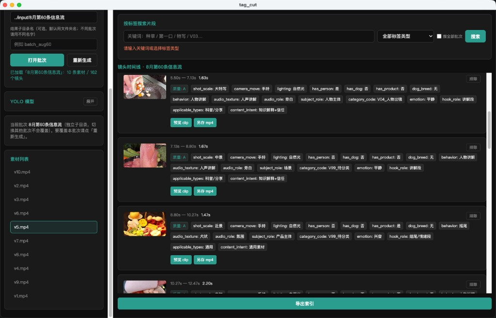

# FeedVideoCut / tag_cut

宠物食品短视频：**镜头拆解 + 多层打标** 引擎与 Electron 审核台。

> 本仓库**不含**业务 SOP 表格、样例成片或其他私有素材。请自备视频放到本地 `input/`。

## 界面示例

审核台：批次 / 素材列表、按标签搜索、镜头时间线与多层标签。



单镜头标签示例（景别 / 运镜 / 行为 / 情绪 / 适用类型等）。


## 快速开始

```bash
cd tag_cut
chmod +x scripts/bootstrap.sh scripts/start_desktop.sh
./scripts/bootstrap.sh --with-desktop
./scripts/start_desktop.sh
```

或仅 CLI：

```bash
cd tag_cut
./scripts/bootstrap.sh
PYTHONPATH=. .venv/bin/python scripts/tag_cut_cli.py analyze --batch ../input/你的批次 --limit 1
```

## 文档

| 文档 | 说明 |
|------|------|
| [tag_cut/README.md](tag_cut/README.md) | 功能与目录 |
| [tag_cut/docs/INSTALL.md](tag_cut/docs/INSTALL.md) | 换机 / zip 安装 |
| [tag_cut/docs/AGENT_INSTALL.md](tag_cut/docs/AGENT_INSTALL.md) | 安装到 Cursor / Claude / Codex |
| [tag_cut/docs/TOOLS.md](tag_cut/docs/TOOLS.md) | 启停与工具脚本 |
| [docs/plans/](docs/plans/) | 设计与实现计划 |

## 隐私与忽略规则

已通过 `.gitignore` 排除：

- `input/` 下成片与表格（xlsx/html/mp4 等）
- `tag_cut/data/`、`exports/`、模型权重 `*.pt`
- `config/local.yaml`、`.env`、`.venv`、`node_modules`

请勿强制 `git add -f` 上述路径。

## License

见仓库根目录 [LICENSE](LICENSE)（若尚未拉取，以 GitHub 上文件为准）。
