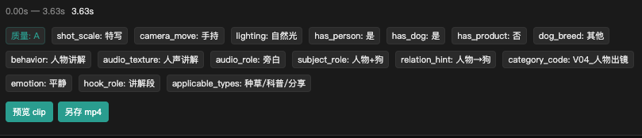

# tag_cut — 宠物短视频拆解打标工具

全自动多层次视频拆解打标 + Electron 审核台。

## 界面示例




## 技术栈

- **Python 3.11+**：分析引擎（FastAPI + Uvicorn）
- **FFmpeg / PySceneDetect**：镜头分割 + 关键帧
- **OpenCV**：画质评估（Laplacian 锐度）
- **Ultralytics YOLOv8**（可选）：目标检测（狗/人/碗等）
- **Electron 32 + React 18 + Vite**：桌面审核台

## 多层识别流水线

| 层 | 内容 | 技术 |
|---|---|---|
| L0 | 媒体事实（时长/分辨率/帧率/编码） | ffprobe |
| split | 镜头分割 + 首/中/尾关键帧 | PySceneDetect + FFmpeg |
| L1 | 目标检测 / 景别 / 画质等级 | YOLOv8（可选）+ 规则 |
| L2 | 音频事件（人声/犬叫/咀嚼）+ 行为（凑近闻/第一口/舔碗…） | 能量+ZCR 规则 |
| L3–L6 | 关系链 / 适用类型 / 编辑价值 / 合规占位 + 能力分 | 规则引擎；可选云端 VLM |

## 快速开始

### 1. 安装依赖

确保已安装 FFmpeg（`brew install ffmpeg`）。从源码包安装请看 `docs/INSTALL.md`。

```bash
cd tag_cut
chmod +x scripts/bootstrap.sh
./scripts/bootstrap.sh                  # 创建 .venv、装依赖、下载推荐 YOLO
# ./scripts/bootstrap.sh --with-desktop # 另装 Electron
# ./scripts/bootstrap.sh --with-skill   # 装到 Cursor/Claude/Codex
```

等价手动步骤：

```bash
cd tag_cut
python3 -m venv .venv
source .venv/bin/activate
pip install -r requirements.txt          # Python 依赖（必须用 .venv）
cd apps/desktop && npm install            # 仅桌面审核台需要
```

Electron 会优先使用 `tag_cut/.venv/bin/python3`。若虚拟环境在别处：

```bash
export TAG_CUT_PYTHON=/path/to/python
```

### 2. 运行测试

```bash
cd tag_cut
PYTHONPATH=. pytest tests/ -v
```

### 3. CLI 一键 smoke 测试

```bash
cd tag_cut
PYTHONPATH=. python scripts/smoke_batch.py \
  --batch "../input/8月第60条信息流" \
  --limit 1
```

输出示例：
```
[smoke] Batch: 8月第60条信息流  |  Videos: 1
  ✓ l0: done  ✓ split: done  ✓ l1: done  ✓ l2: done  ✓ l3_l6: done
  shots=18  keyframes=54  labels=126  scores=18  elapsed: 12.2s
```

### 4. 启动 API 服务（独立使用）

```bash
cd tag_cut
PYTHONPATH=. uvicorn services.app:app --port 8765 --reload
```

### 5. 启动 Electron 桌面应用

一键（推荐，会先关掉占用 5173/8765 的旧进程）：

```bash
cd tag_cut
./scripts/start_desktop.sh
# 或：cd apps/desktop && npm start
```

只停止：

```bash
./scripts/stop_desktop.sh
# 或：cd apps/desktop && npm stop
```

等价手动：

```bash
cd tag_cut/apps/desktop
npm run electron:dev     # 开发模式（同时启动 Vite + Electron）
```

Electron 会自动启动 Python 后台服务；应用打开后：
1. 输入批次目录路径（默认 `../input/8月第60条信息流`）
2. 点击「打开批次」或「重新生成」→ 查看逐层进度
3. 左侧「YOLO 模型」可下载/切换权重，并「检测本机环境」看支持/推荐标记
4. 右侧「按标签搜索片段」可按行为/景别/适用类型等检索，点击结果跳转镜头
5. 标记废片、导出索引

## YOLO 权重

- 本机推荐权重会下载到 `models/`（Apple M4 16GB 默认 `yolov8n.pt`）
- 列表含 YOLOv8 / YOLO11 的 n/s/m/l/x；性能更强的机器可下载更大模型后点「设为当前」
- 当前模型写入 `config/local.yaml`（不进 git），下次分析生效

API：
- `GET /models/yolo` / `GET /models/yolo/env`
- `POST /models/yolo/{id}/download` · `POST /models/yolo/activate`
- `GET /tags/query?q=种草&batch_id=...` · `GET /tags/facets`（兼容旧路径 `/search`）

## 云端 VLM（L3–L6 增强，默认关闭）

编辑 `config/default.yaml`：

```yaml
providers:
  llm:
    cloud_vlm:
      enabled: true            # 改为 true
      model: gpt-4o
      api_key_env: OPENAI_API_KEY
      confidence_threshold: 0.6
```

然后设置环境变量：

```bash
export OPENAI_API_KEY=sk-...
```

开启后仅发送每镜最多 3 帧关键帧 + 已有标签摘要（不传完整视频）。

## 目录结构

```
tag_cut/
├── apps/desktop/      # Electron + React 审核台
├── config/            # 配置文件
├── schemas/           # JSON Schema 数据契约
├── services/          # FastAPI 服务 + 工具函数
├── pipelines/         # 各层流水线（ingest/split/tag_l1…）
├── providers/         # 视觉/音频/LLM Provider
├── tests/             # pytest 测试套件
├── scripts/           # CLI 工具
├── data/              # 分析结果（gitignored，可重建）
├── exports/           # 导出索引（gitignored）
└── models/            # 模型权重（gitignored）
```

## 设计文档

- `docs/plans/2026-09-03-tag-cut-design.md` — 完整设计
- `docs/plans/2026-09-03-tag-cut.md` — 实现计划
- `docs/AGENT_INSTALL.md` — **给 Agent 读**：安装到 Cursor / Claude / Codex skill，对话调 CLI
